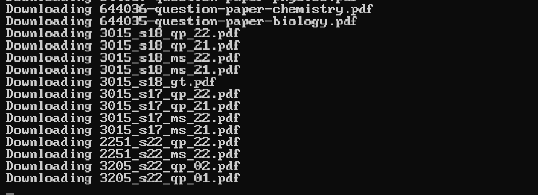
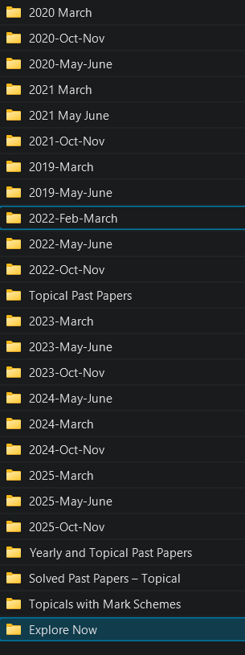
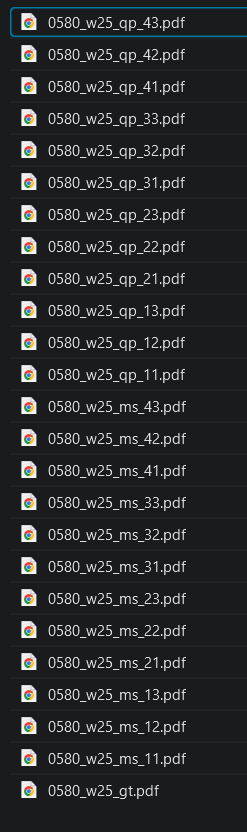

# 🍝 PastaPaper 🍝

## (patched & optimized fork of PastPapersDownloader)

i've tried to make this as easy to set up and use as possible for people who aren't very handy with computers. 
this program uses multithreaded requests to download past papers for caie AS/A-Levels, IGCSE, and O-Level classes. all exams are gathered from the pastpapers subdomain directory.

this fork is actively maintained. i hope. 

---

## installation & dependencies

### operating systems:
*   linux (Debian/Ubuntu)
*   MacOSX
*   Windows

### execution requirements:
*   python3
*   beautifulsoup4
*   lxml
*   requests

install all required python parser libraries and dependencies at once:
```bash
pip install -r requirements.txt
```

---

## how to use

1. open a terminal inside your root project folder.
2. execute the script using the standard CLI flags:
   ```bash
   python -B main.py -I 0580
   ```
   *(the `-B` flag is recommended to stop python from making those annoying `__pycache__` folders and force it to load your edits instantly).*

### CLI commands:
```bash
usage: main.py [-h] [-A AICE] [-O ORDINARY] [-I IGCSE] [-LA] [-LO] [-LI]

optional arguments:
  -h, --help            show this help message and exit
  -A AICE, --AICE       downloads AS and A-Level exams with the syllabus code.
  -O ORDINARY, --ORD    downloads O-Level exams with the syllabus code.
  -I IGCSE, --IGCSE     downloads IGCSE exams with the syllabus code.
  -LA, --LISTAICE       lists all AS and A-Level classes with their syllabus codes.
  -LO, --LISTORDINARY   lists all O-Level classes with their syllabus codes.
  -LI, --LISTIGCSE      lists all IGCSE classes with their syllabus codes.
```

---

## verification & output structure

when you run the script, the terminal will start downloading everything and show you what it's fetching in real-time:



the files go into a local `output/` folder, organized by subject, year, and season:



inside each folder, the filters keep only the exact papers you need (like skipping core papers if you are taking extended):



---

## advanced download configurations & filters

you can customize your configurations inside `web_data.py`. you can set your years and exclude specific papers directly inside the `FILTER_CONFIG` dictionary at the top of the file without messing with the main code.

```python
FILTER_CONFIG = {
    "your_subject_code": {
        "min_year": 2022,
        "exclude_regex": r"your_exclusion_regex_here"
    }
}
```

### how to add subjects & years
to add a subject, put its 3 or 4-digit syllabus code as a key in `FILTER_CONFIG`.
*   **`min_year`**: the oldest year you want. anything older than this gets skipped so you don't waste disk space on ancient papers.

### how to skip AS or A2 papers
cambridge dumps both AS and A2 under the same code. you can filter them out using the `exclude_regex` line:

*   **to download AS-Level only (skipping A2):**
    set the regex to target papers 3 and 4 (which are the A2 ones):
    ```python
    "exclude_regex": r"_(qp|ms|er|in|ci|sf|qr|rp)_(3|4)\d"
    ```
*   **to download A2-Level only (skipping AS):**
    set the regex to target papers 1 and 2 (which are the AS ones):
    ```python
    "exclude_regex": r"_(qp|ms|er|in|ci|sf|qr|rp)_(1|2)\d"
    ```
    and as such, if we were downloading AS Level Math past papers (which have a special format), we would instead enter:
    ```python
    "exclude_regex": r"_(qp|ms|er|in|ci|sf|qr|rp)_(2|3|5|6)\d"
    ```
*   **to download Extended tiers only (skipping Core):**
    for subjects like math (`0580`) and physics (`0625`), core papers end in 1 and 3. skip them using:
    ```python
    "exclude_regex": r"_(qp|ms|er|in|ci|qr|rp)_(1|3)\d"
    ```

---

## why I fixed this code:

*   **fixed silent startup crashes:** merged the arguments parser directly into `main.py`. this stops python from getting confused by our local `parser.py` file and the built-in library module named `parser` (which made the script exit with zero output).
*   **fixed silent download crashes:** resolved a background thread crash inside `mainMethods.py` by unpacking the list array correctly using `[0]` so the downloader doesn't choke.
*   **fixed dead links:** updated `links.py` to point directly to the new, working pastpapers subdomain instead of dead pages.
*   **blocked spam files:** added filters inside `web_data.py` to make sure we only download papers matching our subject code. this blocks all the random welsh and edexcel spam files papacambridge put on their pages.
*   **fixed broken folder creation:** made sure the script only downloads actual files (like `.pdf` and `.zip`). this stops it from trying to save marketing buttons like `Explore Now\` as folders, which crashed the downloader on windows.
